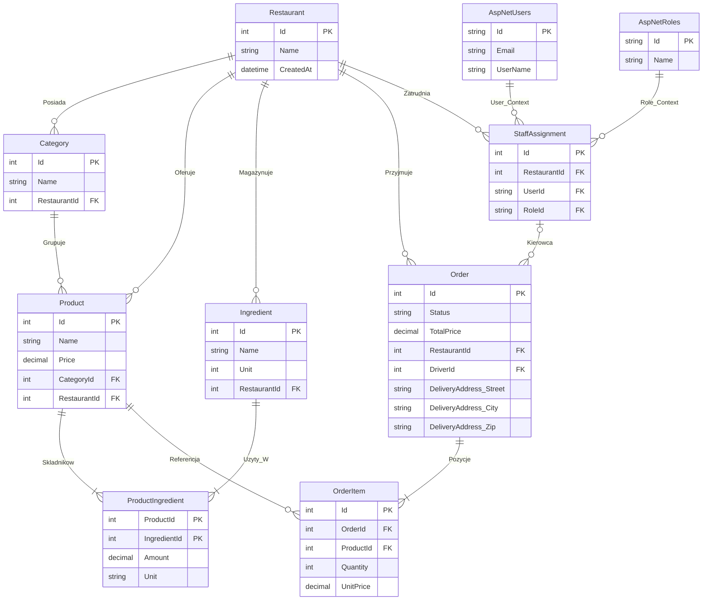

```mermaid
erDiagram
    %% --- DOMAIN CORE ---
    Restaurant {
        int Id PK
        string Name
        datetime CreatedAt
    }
    Category {
        int Id PK
        string Name
        int RestaurantId FK
    }
    Product {
        int Id PK
        string Name
        decimal Price
        int CategoryId FK
        int RestaurantId FK
    }
    Ingredient {
        int Id PK
        string Name
        int Unit
        int RestaurantId FK
    }
    ProductIngredient {
        int ProductId PK
        int IngredientId PK
        decimal Amount
        string Unit
    }
    Order {
        int Id PK
        string Status
        decimal TotalPrice
        int RestaurantId FK
        int DriverId FK
        string DeliveryAddress_Street
        string DeliveryAddress_City
        string DeliveryAddress_Zip
    }
    OrderItem {
        int Id PK
        int OrderId FK
        int ProductId FK
        int Quantity
        decimal UnitPrice
    }
    StaffAssignment {
        int Id PK
        int RestaurantId FK
        string UserId FK
        string RoleId FK
    }
    %% --- IDENTITY ---
    AspNetUsers {
        string Id PK
        string Email
        string UserName
    }
    AspNetRoles {
        string Id PK
        string Name
    }

    %% --- RELATIONS ---
    Restaurant ||--o{ Category : "Posiada"
    Restaurant ||--o{ Product : "Oferuje"
    Restaurant ||--o{ Ingredient : "Magazynuje"
    Restaurant ||--o{ Order : "Przyjmuje"
    Restaurant ||--o{ StaffAssignment : "Zatrudnia"
    Category ||--o{ Product : "Grupuje"
    Product ||--|{ ProductIngredient : "Skladnikow"
    Ingredient ||--|{ ProductIngredient : "Uzyty_W"
    Order ||--|{ OrderItem : "Pozycje"
    Product ||--o{ OrderItem : "Referencja"
    StaffAssignment |o--o{ Order : "Kierowca"
    AspNetUsers ||--o{ StaffAssignment : "User_Context"
    AspNetRoles ||--o{ StaffAssignment : "Role_Context"
```
