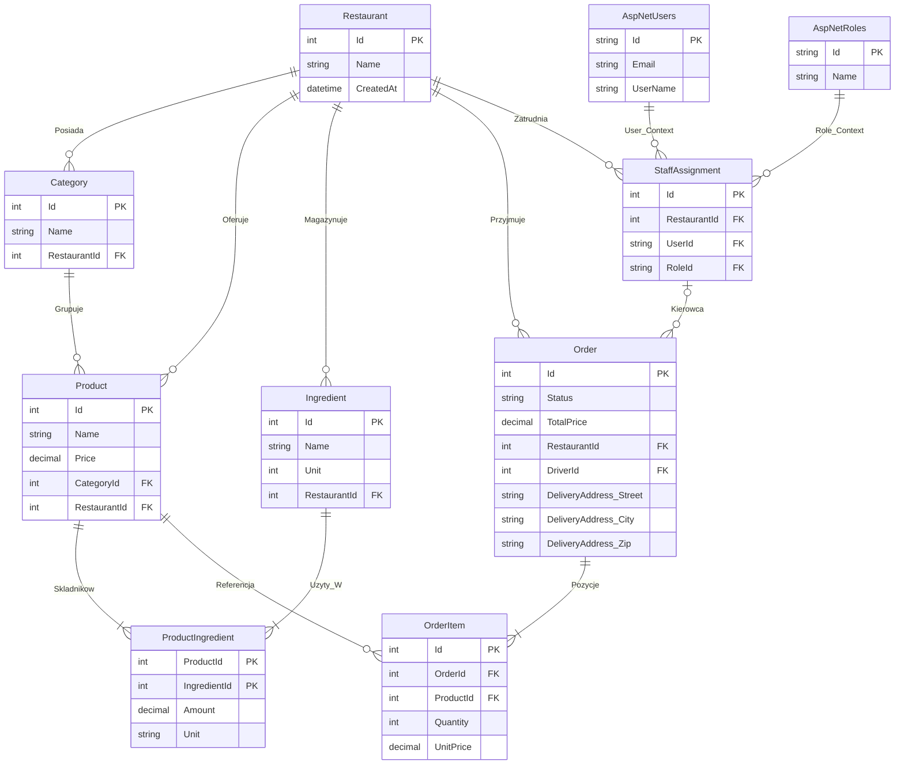

# PosRestaurant API

> Backendowe API dla systemu POS (Point of Sale) w modelu SaaS dla gastronomii.

> Backend API for the POS (Point of Sale) system in the SaaS model for gastronomy.

  <a href="#-wersja-polska">🇵🇱 Wersja Polska</a> •
  <a href="#-english-version">🇬🇧 English Version</a>

---

## 🇵🇱 Wersja Polska

### O Projekcie
Projekt zbudowany w oparciu o **.NET 8**, realizujący zasady **Czystej Architektury (Clean Architecture)** oraz wzorce **Domain-Driven Design (DDD)**. System obsługuje pełną wielodostępność (**Multi-tenancy**), zapewniając ścisłą izolację danych i bezpieczeństwo dla wielu restauracji w jednej bazie danych.

Projekt jest ciągle w trakcie rozwoju, w przyszłości chcę dodać:
- testy jednostkowe i integracyjne,
- obsługę płatności online,
- frontend z wykorzystaniem **React**
- i inne funkcjonalności zgodne z potrzebami branży gastronomicznej (generowanie raportów, statystki etc.).
### Kluczowe Funkcjonalności

#### 🔐 Multi-Tenancy i Bezpieczeństwo
* **Izolacja Danych:** Wdrożona na poziomie `DbContext` przy użyciu mechanizmu `Validate TenantSecurity` i interfejsu `ITenantEntity`. System automatycznie filtruje i przypisuje dane do właściwej restauracji, uniemożliwiając wyciek informacji.
* **Dwuetapowe Uwierzytelnianie:**
    1.  **Globalne Logowanie:** Użytkownik loguje się do systemu ("Lobby").
    2.  **Wybór Kontekstu:** Użytkownik wybiera restaurację, otrzymując kontekstowy token JWT z rolami (np. Manager, Cook, Driver).
* **Uprawnienia (RBAC):** Zarządzane przez encję `StaffAssignment`, pozwalającą jednemu użytkownikowi pełnić różne role w różnych restauracjach.
* **Filtry Bezpieczeństwa:** Dedykowany filtr `Validate RestaurantAccess Filter` chroni endpointy przed dostępem *Cross-Tenant*.

#### 📦 Zarządzanie Produktami i Magazynem
* **Rich Domain Models:** Produkty, Składniki i Kategorie to hermetyzowane encje domenowe, chroniące spójność biznesową (np. unikalność nazw, dodatnie ceny).
* **System Receptur:** Produkty składają się ze składników z precyzyjnymi miarami (`decimal precision`) i jednostkami (Kg, L, Pcs), obsługiwanymi przez **Value Objects**.
* **Logika PATCH:** Implementacja częściowej aktualizacji zasobów z zachowaniem reguł biznesowych.

#### 🍕 Przetwarzanie Zamówień (Core Business)
* **Złożony Agregat Order:** Encja `Order` zarządza całym cyklem życia zamówienia (`Pending` -> `InPreparation` -> `Ready` -> `Completed` / `InDelivery`).
* **Snapshot Cen:** Pozycje zamówienia (`OrderItem`) zapisują kopię nazwy i ceny produktu w momencie zakupu, gwarantując niezmienność historii finansowej.
* **Dzienna Numeracja:** System generuje czytelne dla użytkownika numery sekwencyjne w bezpiecznej transakcji bazodanowej.
* **Obsługa Dostaw:** Specjalistyczna logika dla typu `Delivery`, wymagająca adresu (Value Object) i przypisania kierowcy.

### 🏗️ Architektura
Rozwiązanie zbudowane na podstawie struktury **Clean Architecture Monolith**, podzielone na cztery warstwy:

1.  **Domain:** Serce systemu. Zawiera Encje, Value Objects, Enumy i Interfejsy Repozytoriów. Brak zależności zewnętrznych.
2.  **Application:** Orkiestracja logiki biznesowej. Zawiera Serwisy, DTO (Command/Query), Walidatory (FluentValidation) i Mapowania (AutoMapper).
3.  **Infrastructure:** Implementacja detali technicznych. EF Core DbContext, Repozytoria, UnitOfWork, serwisy tożsamości (JWT, PinHasher), Migracje.
4.  **WebAPI:** Punkt wejścia. Kontrolery REST, Middleware (Global Error Handling), Konfiguracja DI (Wzorzec Instalatorów).

### 🛠️ Tech Stack & Wzorce

| Kategoria | Technologia / Wzorzec |
| :--- | :--- |
| **Framework** | .NET 8 (ASP.NET Core Web API) |
| **Baza Danych** | SQL Server / Entity Framework Core 8 |
| **Walidacja** | FluentValidation |
| **Mapowanie** | AutoMapper |
| **Auth** | ASP.NET Core Identity + JWT Bearer |
| **Dokumentacja** | Swagger / OpenAPI |

**Zastosowane Wzorce Projektowe:**
* Repository & Unit of Work
* Factory Method (tworzenie encji)
* Strategy (rejestracja serwisów - Installers)
* Explicit Interface Implementation (ochrona Tenant ID)
* Global Exception Handling (RFC 7807 ProblemDetails)

### 📊 Schemat Bazy Danych (ER Diagram)

## 🇬🇧 English Version

### About
A backend API for a SaaS Point of Sale (POS) system for restaurants. I built this project to learn and demonstrate how to create solid software using **.NET 8**, **Clean Architecture**, and **Domain-Driven Design (DDD)**.
The main feature is **Multi-tenancy** - many restaurants can use one database, but each sees only its own data and is safe from others.

The project is still under development. In the future, I plan to add:
- unit and integration tests,
- online payment support,
- a frontend built with React,
- other features tailored to the needs of the gastronomy industry (report generation, statistics, etc.).
### Key Features

#### 🔐 Multi-Tenancy & Security
* **Data Safety:** A special mechanism in the database makes sure one restaurant's data doesn't leak to another using `ITenantEntity` interface.
* **Login Process:**
    1.  **Global Login:** User logs into the main system.
    2.  **Context Selection:** User chooses a restaurant to work in, receiving a context-aware JWT token (e.g., as a Manager or Cook).
* **Permissions (RBAC):** Managed by `StaffAssignment` entity. One user can have different roles in different restaurants (e.g., Manager in one, Waiter in another).
* **Protection:** Dedicated filters ensure a user cannot access data from a restaurant they don't belong to (Cross-Tenant protection).

#### 📦 Products & Inventory
* **Rich Domain Models:** Products and ingredients are encapsulated domain entities with built-in rules (e.g., price can't be negative, name can't be empty).
* **Recipes System:** Each product is made of ingredients. The system handles exact weights (decimal precision) and different units (kg, pieces, liters) using **Value Objects**.
* **Safe Updates:** Implementation of logic allowing safe partial updates of resources without breaking business consistency.

#### 🍕 Orders (Core Business)
* **Order Aggregate:** Handles the full lifecycle from creation (`Pending`), through the kitchen (`In Preparation`), to delivery/pickup (`Ready` / `Completed`).
* **Price History (Snapshot):** When a customer orders an item, the system saves its current price and name in `OrderItem`. Even if the menu changes later, the financial history remains correct.
* **Sequential Numbering:** The system creates simple, human-readable order numbers (e.g., "Order #5 today") separately for each restaurant and each day.
* **Delivery:** specialized logic for delivery orders requiring an address and driver assignment.

### 🏗️ Architecture
The project is divided into 4 main layers to maintain separation of concerns:

1.  **Domain:** The core. Defines what a Product, Order, or Restaurant is. No external dependencies.
2.  **Application:** Business logic (Services, Use Cases). Defines "what needs to happen", validates data, and orchestrates the flow.
3.  **Infrastructure:** Technical details - database connection (EF Core), identity services, external adapters.
4.  **WebAPI:** The entry point. Controllers, Middleware, and Dependency Injection setup.

### 🛠️ Tech Stack
| Kategoria | Technologia / Wzorzec |
| :--- | :--- |
| **Framework** | .NET 8 (ASP.NET Core Web API) |
| **Database** | SQL Server / Entity Framework Core 8 |
| **Validation** | FluentValidation |
| **Mapping** | AutoMapper |
| **Auth** | ASP.NET Core Identity + JWT Bearer |
| **Documentation** | Swagger / OpenAPI |