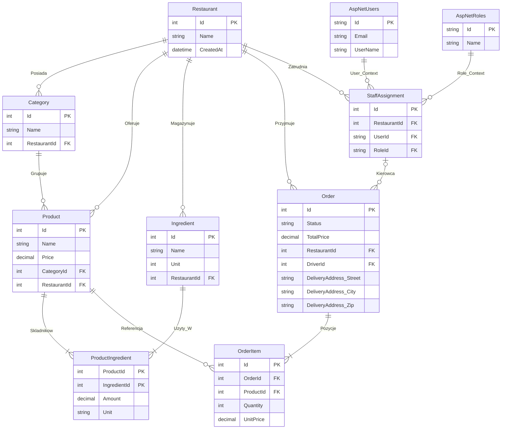

🍽️ PosRestaurant API – in progress
🇬🇧 English version below / Angielska wersja poniżej
🇵🇱 Wersja Polska
API backendowe dla systemu POS (Point of Sale) w modelu SaaS dla gastronomii. Projekt zbudowany w oparciu o .NET 8, realizujący zasady Czystej Architektury (Clean Architecture) oraz wzorce Domain-Driven Design (DDD).
System obsługuje pełną wielodostępność (Multi-tenancy), zapewniając ścisłą izolację danych i bezpieczeństwo dla wielu restauracji w jednej bazie danych.
🚀 Kluczowe Funkcjonalności
🏢 Multi-Tenancy i Bezpieczeństwo
•	Izolacja Danych: Wdrożona na poziomie DbContext przy użyciu mechanizmu ValidateTenantSecurity i interfejsu ITenantEntity. System automatycznie filtruje i przypisuje dane do właściwej restauracji, uniemożliwiając wyciek informacji.
•	Dwuetapowe Uwierzytelnianie:
1.	Globalne Logowanie: Użytkownik loguje się do systemu ("Lobby").
2.	Wybór Kontekstu: Użytkownik wybiera restaurację, otrzymując kontekstowy token JWT z rolami (np. Manager, Cook, Driver).
•	Uprawnienia (RBAC): Uprawnienia zarządzane przez encję StaffAssignment, pozwalającą jednemu użytkownikowi pełnić różne role w różnych restauracjach.
•	Filtry Bezpieczeństwa: Dedykowany filtr ValidateRestaurantAccessFilter chroni endpointy przed dostępem Cross-Tenant.
📦 Zarządzanie Produktami i Magazynem
•	Rich Domain Models: Produkty, Składniki i Kategorie to hermetyzowane encje domenowe, chroniące spójność biznesową (np. unikalność nazw, dodatnie ceny).
•	System Receptur: Produkty składają się ze składników z precyzyjnymi miarami (decimal precision) i jednostkami (Kg, L, Pcs), obsługiwanymi przez Value Objects.
•	Logika PATCH: Implementacja częściowej aktualizacji zasobów z zachowaniem reguł biznesowych.
🍕 Przetwarzanie Zamówień (Core Business)
•	Złożony Agregat Order: Encja Order zarządza całym cyklem życia zamówienia (Pending -> InPreparation -> Ready -> Completed / InDelivery).
•	Snapshot Cen: Pozycje zamówienia (OrderItem) zapisują kopię nazwy i ceny produktu w momencie zakupu, gwarantując niezmienność historii finansowej.
•	Dzienna Numeracja: System generuje czytelne dla użytkownika numery sekwencyjne w bezpiecznej transakcji bazodanowej.
•	Obsługa Dostaw: Specjalistyczna logika dla typu Delivery, wymagająca adresu (Value Object) i przypisania kierowcy.
🏗️ Architektura
Rozwiązanie zbudowanie na podstawie struktury Clean Architecture Monolith, podzieloną na cztery warstwy:
1.	Domain: Serce systemu. Zawiera Encje, Value Objects, Enumy i Interfejsy Repozytoriów. Brak zależności zewnętrznych.
2.	Application: Orkiestracja logiki biznesowej. Zawiera Serwisy, DTO (Command/Query), Walidatory (FluentValidation) i Mapowania (AutoMapper).
3.	Infrastructure: Implementacja detali technicznych. EF Core DbContext, Repozytoria, UnitOfWork, serwisy tożsamości (JWT, PinHasher), Migracje.
4.	WebAPI: Punkt wejścia. Kontrolery REST, Middleware (Global Error Handling), Konfiguracja DI (Wzorzec Instalatorów).
🛠️ Tech Stack & Wzorce
•	Framework: .NET 8 (ASP.NET Core Web API)
•	Baza Danych: SQL Server / Entity Framework Core 8
•	Walidacja: FluentValidation
•	Mapowanie: AutoMapper
•	Auth: ASP.NET Core Identity + JWT Bearer
•	Dokumentacja: Swagger / OpenAPI (Swashbuckle)
•	Zastosowane Wzorce:
o	Repository & Unit of Work
o	Factory Method (tworzenie encji)
o	Strategy (rejestracja serwisów - Installers)
o	Explicit Interface Implementation (ochrona Tenant ID)
o	Global Exception Handling (RFC 7807 ProblemDetails)
📝 Licencja
Projekt udostępniony na licencji MIT.
Stworzono z dbałością o jakość kodu i zasady SOLID.
------

-----

🇬🇧 English Version
A backend API for a SaaS Point of Sale (POS) system for restaurants. I built this project to learn and demonstrate how to create solid software using .NET 8, Clean Architecture, and Domain-Driven Design (DDD).
The main feature is Multi-tenancy – many restaurants can use one database, but each sees only its own data and is safe from others.
🏢 Multi-Tenancy & Security
•	Data Safety: A special mechanism in the database makes sure one restaurant's data doesn't leak to another.
•	Login Process:
1.	User logs into the main system.
2.	User chooses a restaurant to work in (e.g., as a Manager or Cook).
•	Permissions: One user can have different roles in different restaurants (e.g., Manager in one, Waiter in another).
•	Protection: The API checks if a user is trying to access data from a restaurant they don't belong to.
📦 Products & Inventory
•	Real Models: Products and ingredients have built-in rules (e.g., price can't be negative, name can't be empty).
•	Recipes: Each product is made of ingredients. The system handles exact weights (e.g., 0.5 kg) and different units (kg, pieces, liters).
•	Updates: You can change product details (like price) safely without breaking other data.
🍕 Orders (The Core)
•	Full Process: Handles an order from creation ("Pending"), through the kitchen ("In Preparation"), to delivery/pickup ("Ready/Completed").
•	Price History: When a customer orders a pizza, the system saves its current price and name. Even if you change the menu tomorrow, the order history stays correct.
•	Numbering: The system creates simple order numbers (e.g., "Order #5 today") – separately for each restaurant and each day.
•	Delivery: Supports delivery orders – requires an address and assigning a driver.
🏗️ Architecture
The project is divided into 4 main layers to keep the code clean and easy to maintain:
1.	Domain: The most important part. It defines what a Product, Order, or Restaurant is. This layer doesn't depend on any external libraries.
2.	Application: This is the business logic (Services). It says "what needs to happen" (e.g., "Create an order"), checks if data is correct, and saves it.
3.	Infrastructure: Technical details – database connection, saving and reading data, handling passwords.
4.	WebAPI: The entry point. It contains Controllers that receive requests from the internet (e.g., from a mobile app).
🛠️ Tech Stack
•	Language: C# (.NET 8)
•	Database: SQL Server (with Entity Framework Core 8)
•	Validation: FluentValidation
•	Mapping: AutoMapper
•	Auth: ASP.NET Core Identity + JWT Bearer
•	Documentation: Swagger / OpenAPI
📝 License
This project is licensed under the MIT License.

